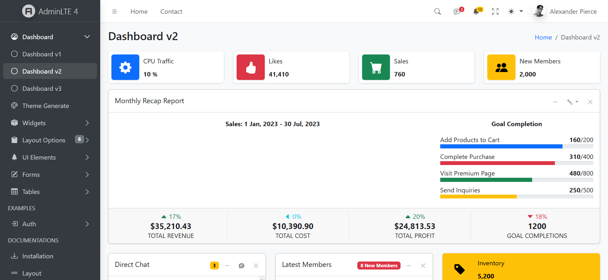

# AdminLTE Dashboard Integration with ASP.NET Core
This project demonstrates how to integrate the AdminLTE template with an ASP.NET Core application. AdminLTE is a popular open-source dashboard template that provides a clean and responsive design, ideal for building administrative interfaces.

# Features
AdminLTE Template Integration: Full integration of AdminLTE into an ASP.NET Core MVC project.
Responsive Design: AdminLTE's responsive layout ensures the dashboard works well on all devices.
UI Components: Utilizes various AdminLTE components like charts, tables, forms, and widgets.
ASP.NET Core MVC: Standard ASP.NET Core MVC architecture with Controllers, Views, and Models.
Authentication: Includes basic user authentication for the admin panel.
# Prerequisites
Before you begin, ensure you have met the following requirements:

.NET 6 or higher installed on your machine.
Visual Studio 2022 or any IDE with support for ASP.NET Core.
Basic knowledge of ASP.NET Core MVC.
# Setup Instructions
## 1. Clone the repository
Clone this repository to your local machine using the following command:

bash
Copy
Edit
git clone https://github.com/smraju115/Admin-LTE-Dasboard-Intregate-Asp.NET-Core.git
## 2. Install dependencies
Open the project in Visual Studio (or your preferred IDE) and restore the NuGet packages:

bash
Copy
Edit
dotnet restore
## 3. Configure Database
Make sure your appsettings.json file contains the correct connection string to your database. If using SQL Server, you should have a connection string like:

json
Copy
Edit
"ConnectionStrings": {
    "DefaultConnection": "Server=localhost;Database=AdminDashboard;Trusted_Connection=True;"
}
## 4. Run Migrations
If you're using Entity Framework for database access, run the migrations to set up your database:

bash
Copy
Edit
dotnet ef database update
## 5. Build and Run the Application
Now that everything is set up, build and run the application:

bash
Copy
Edit
dotnet run
Visit http://localhost:5000 in your browser to access the dashboard.

# Folder Structure
The project is structured as follows:

Controllers: Contains all the controllers for handling HTTP requests.
Views: Contains the Razor views for displaying the UI.
Models: Contains the models for data representation.
wwwroot: Contains static files like CSS, JavaScript, and images.

# Customization
Feel free to customize the AdminLTE template by modifying the HTML, CSS, and JavaScript files under the wwwroot folder. You can add or remove UI components based on your project's requirements.

# Contributing
Fork the repository.
Create a new branch (git checkout -b feature-branch).
Make your changes.
Commit your changes (git commit -m 'Add new feature').
Push to the branch (git push origin feature-branch).
Create a pull request.
# License
This project is licensed under the MIT License - see the LICENSE file for details.
